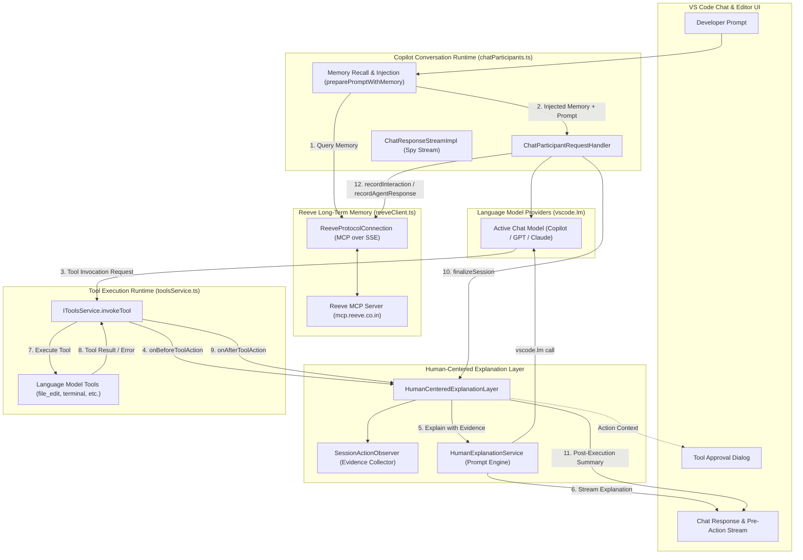

# Reeve

**Reeve** is a developer-focused AI coding environment built on Code - OSS, designed to make coding agents more understandable, context-aware, and useful over long-running software projects.

Reeve combines:

- **Persistent project memory** powered by [Reeve](https://mcp.reeve.co.in)
- **GitHub Copilot model integration** for AI coding workflows
- **Human-centered agent responses** that explain what changed, why, impact, and trade-offs
- **Live architecture visualization** for understanding how code and agent changes affect the system
- **Temporal project knowledge** so current decisions can supersede outdated ones instead of polluting the agent's context

The goal is simple:

> **Your coding agent should remember your codebase, understand its architecture, and explain its decisions.**

---

## Why Reeve?

Long-running coding agents accumulate conversations, tool output, repository context, previous assumptions, and historical decisions. As this context grows, important information can become difficult to retrieve reliably.

Reeve addresses this with persistent, temporal project memory.

Instead of relying only on the current agent context:

```text
Conversation
+ Tool output
+ Current files
        ↓
      Agent
```

Reeve adds durable project knowledge:

```text
Current task
     +
Current code
     +
Relevant Reeve memory
     ↓
    Agent
```

Reeve can retain information such as:

* architectural decisions
* project constraints
* implementation conventions
* previous changes
* historical context
* known issues
* relationships between components

Because the memory is temporal, newer facts can supersede older decisions instead of leaving the agent with contradictory context.

---

# Human-Centered Coding Agent

Reeve is designed around a core principle:

> **The developer should understand the agent's decisions rather than blindly approve them.**

Instead of silent changes or cryptic execution logs, Reeve provides concise, evidence-grounded explanations directly in the chat workflow:

```text
Agent Action Flow
─────────────────
User Prompt + Coding Agent Action
       │
       ▼
Action Observer (Filters meaningful actions: edits, creates, deletes, commands)
       │
       ▼
Context Builder (Captures diff, target, command, execution result, Reeve memory)
       │
       ▼
Human Explanation Model (Copilot LM with strict evidence-only prompt)
       │
       ▼
Developer-Facing Natural Explanation (Pre-execution intent & post-execution outcome)
```

### Key Principles of the Human-Centered Explanation Layer

1. **Evidence-Grounded (Zero Guesswork)**:
   Explanations are strictly derived from the actual code diff, executed command, user request, and relevant Reeve memory. The model does not invent reasons, guess architectural philosophy, or fabricate "duplicated logic across components".

2. **Pre-Execution & Post-Execution Explanations**:
   - **Before Tool Execution**: Explains the intended change and supporting evidence before files are modified or destructive terminal commands run.
   - **After Tool Execution**: Summarizes the actual outcome and verifies results (e.g. test outputs or stdout), avoiding duplicate narration if the agent already explained the change.

3. **Zero Noise on Read-Only Actions**:
   Informational queries (`read_file`, `grep_search`, `list_dir`) execute silently without interrupting the developer with preachy meta-explanations.

4. **Temporal Reeve Memory Integration**:
   Durable project decisions and constraints recalled from Reeve memory inform explanations. Superseded decisions are clearly contextualized as historical notes rather than active constraints.

5. **Fail-Safe & Non-Intrusive**:
   The humanizer operates fail-safe without modifying Copilot's system identity, authentication, entitlement, or model routing. If the explanation model is unavailable or throws, the tool execution proceeds seamlessly.

---

# Architecture Understanding

Reeve includes a live architecture view inspired by tools such as [GitDiagram](https://gitdiagram.com/).

The architecture view is intended to help developers understand:

* project structure
* service and module relationships
* dependencies
* API flows
* important components
* architectural impact of agent changes

Conceptually:

```text
                API
                 │
                 ▼
            Controller
                 │
                 ▼
             Service
              │    │
              ▼    ▼
            Cache  Database
```

As the agent changes the codebase, the architecture view can evolve with it.

Future architecture features include:

```text
BEFORE

API → Controller → Service → Database


PROPOSED

API → Controller → Service → Cache → Database
```

This allows developers to understand not only:

> "What lines changed?"

but also:

> **"What changed in my system?"**

---

# Reeve + GitHub Copilot

Reeve is designed to work with the existing GitHub Copilot model and agent infrastructure available in the Code - OSS environment.

The project intentionally does **not** implement a separate Copilot authentication or entitlement system.

The existing Copilot integration remains responsible for:

* GitHub authentication
* Copilot authentication
* Copilot entitlement
* model availability
* model selection
* Copilot usage limits

Reeve adds capabilities around the agent, including project memory and architecture understanding.

Conceptually:

```text
                    Reeve
                      │
       ┌──────────────┼──────────────┐
       │              │              │
   Persistent     Architecture   Human-centered
     Memory          Graph          Agent UX
       │              │              │
       └──────────────┼──────────────┘
                      │
                 Coding Agent
                      │
              Copilot model
```

Reeve is an independent project and is not an official Microsoft or GitHub product.

---

# How Memory Works

Reeve integrates with the **Reeve MCP Server** using the Model Context Protocol (MCP) over Server-Sent Events (SSE).

A typical memory flow is:

```text
┌──────────────────────────────────────────────────────┐
│                     Reeve                            │
│                                                      │
│  User prompt                                         │
│       │                                              │
│       ▼                                              │
│  Retrieve relevant project memory                   │
│       │                                              │
│       ▼                                              │
│  Durable context added to the agent workflow         │
│       │                                              │
│       ▼                                              │
│  Copilot model                                       │
│       │                                              │
│       ▼                                              │
│  Agent response / code changes                       │
│       │                                              │
│       ▼                                              │
│  Store durable facts / decisions / history           │
└──────────────────────────────────────────────────────┘
```

The objective is **selective retrieval**, not dumping an entire project's history into every prompt.

---

# MCP Memory Operations

The current integration exposes Reeve-backed operations such as:

| Operation                 | Purpose                           |
| ------------------------- | --------------------------------- |
| `retrieve_memory_context` | Retrieve relevant project memory  |
| `store_memory`            | Persist durable project knowledge |
| `query_memory`            | Perform structured memory queries |

Memory can contain temporal information such as:

```text
Decision:
PostgreSQL is the source of truth for transactions.

Constraint:
Payment operations must remain idempotent.

History:
Authentication was moved from controllers into middleware.

Supersession:
MongoDB → PostgreSQL
```

This allows the agent to distinguish current knowledge from historical or superseded information.

---

# Project Structure

Reeve-specific integration currently lives inside:

```text
extensions/copilot/
├── src/
│   ├── platform/reeve/
│   │   ├── common/
│   │   │   ├── reeveActionObserver.ts
│   │   │   └── reeveClient.ts
│   │   ├── node/
│   │   │   ├── humanCenteredExplanationLayer.ts
│   │   │   ├── humanExplanationService.ts
│   │   │   ├── reeveActionObserver.ts
│   │   │   ├── reeveClient.ts
│   │   │   └── test/
│   │   │       └── humanCenteredExplanationLayer.spec.ts
│   │   └── test/node/
│   │       └── reeveClient.spec.ts
│   │
│   └── extension/
│       ├── conversation/vscode-node/
│       │   └── chatParticipants.ts
│       ├── tools/node/
│       │   ├── reeveSearchMemoryTool.ts
│       │   └── test/
│       │       └── reeveSearchMemoryTool.spec.ts
│       └── extension/vscode-node/
│           └── services.ts
│
└── package.json
```

### Key Files

| File | Purpose |
| --- | --- |
| [`platform/reeve/node/reeveClient.ts`](vscode/extensions/copilot/src/platform/reeve/node/reeveClient.ts) | MCP client and SSE transport |
| [`platform/reeve/common/reeveClient.ts`](vscode/extensions/copilot/src/platform/reeve/common/reeveClient.ts) | Reeve service interface and types |
| [`platform/reeve/node/humanExplanationService.ts`](vscode/extensions/copilot/src/platform/reeve/node/humanExplanationService.ts) | Copilot chat model-driven human explanation service |
| [`platform/reeve/node/humanCenteredExplanationLayer.ts`](vscode/extensions/copilot/src/platform/reeve/node/humanCenteredExplanationLayer.ts) | Action explanation lifecycle and streaming layer |
| [`platform/reeve/node/reeveActionObserver.ts`](vscode/extensions/copilot/src/platform/reeve/node/reeveActionObserver.ts) | Meaningful action observer and raw evidence collector |
| [`platform/reeve/common/reeveActionObserver.ts`](vscode/extensions/copilot/src/platform/reeve/common/reeveActionObserver.ts) | Action evidence, context, and observer interfaces |
| [`conversation/vscode-node/chatParticipants.ts`](vscode/extensions/copilot/src/extension/conversation/vscode-node/chatParticipants.ts) | Integration with Copilot conversation workflows |
| [`tools/node/reeveSearchMemoryTool.ts`](vscode/extensions/copilot/src/extension/tools/node/reeveSearchMemoryTool.ts) | Reeve memory tool exposed to the coding agent |
| [`extension/vscode-node/services.ts`](vscode/extensions/copilot/src/extension/extension/vscode-node/services.ts) | Reeve dependency-injection registration |

---

# Setup

## Prerequisites

* Node.js 22+
* [fnm](https://github.com/Schniz/fnm) recommended
* A Reeve API key
* A GitHub account with the appropriate Copilot access for Copilot-powered workflows

## Build from Source

```bash
git clone https://github.com/Ampplex/Reeve-Copilot.git
cd Reeve-Copilot/vscode

fnm use
npm install
```

Build/watch the repository using the VS Code development workflow.

For Copilot development, follow the repository's current Copilot/Code - OSS development instructions before launching the application.

Run the development build with:

```bash
./scripts/code.sh
```

---

# Configure Reeve

Open VS Code settings and search for `reeve`.

| Setting                          | Description                          | Default                   |
| -------------------------------- | ------------------------------------ | ------------------------- |
| `github.copilot.reeve.enabled`   | Enable/disable Reeve memory          | `true`                    |
| `github.copilot.reeve.serverUrl` | Reeve MCP server URL                 | `https://mcp.reeve.co.in` |
| `github.copilot.reeve.apiKey`    | Reeve API key / authentication token | —                         |

Alternatively:

```bash
export REEVE_API_KEY="..."
```

or:

```bash
export REEVE_AUTH_TOKEN="..."
```

---

# Architecture

Reeve operates as an integrated platform inside Code - OSS / GitHub Copilot, bridging persistent cloud memory with local agent execution and developer-facing explanations.



---

## Subsystem Breakdown

### 1. Persistent Long-Term Memory Subsystem

The memory subsystem interfaces with the Reeve Cloud MCP Server over Server-Sent Events (SSE) with HTTP POST message transport.

* **Encapsulated Recall (`preparePromptWithMemory`)**:
  Before the model receives the prompt, Reeve queries `retrieve_memory_context` with the user request and active workspace namespace. If relevant architectural decisions or constraints exist, they are injected into the prompt with strict adherence directives.
* **Citation Rendering (`renderMemoryCitation`)**:
  Recalled memories display an attribution badge (`🧠 Recalled from Reeve Long-Term Memory`) directly in the chat UI.
* **Autonomous Interaction Logging (`recordInteraction` & `recordAgentResponse`)**:
  Prompts, file attachments (via `extractAttachmentText`), and agent responses are stored asynchronously in the background.

```text
Reeve Client                         Reeve MCP Server
     │                                      │
     │──── GET /sse ───────────────────────►│
     │     Authorization: Bearer <token>    │
     │                                      │
     │◄─── SSE endpoint event ──────────────│
     │                                      │
     │──── POST /messages ─────────────────►│
     │     initialize                       │
     │                                      │
     │◄─── SSE message ────────────────────│
     │                                      │
     │──── POST /messages ─────────────────►│
     │     tools/call (retrieve_memory)     │
     │                                      │
     │◄─── SSE message ────────────────────│
     │     result                           │
     └──────────────────────────────────────┘
```

---

### 2. Human-Centered Explanation Subsystem

The explanation layer eliminates synthetic heuristic guessing (~1,000 lines of regex/AST rules) in favor of a lightweight, model-driven, evidence-based pipeline.

* **Action Observation (`SessionActionObserver`)**:
  - Intercepts tool calls and classifies them into `FileEdit`, `FileCreate`, `FileDelete`, `ShellCommand`, `TestRun`, or `CodebaseSearch`.
  - Filters out read-only tools (`read_file`, `grep_search`, `list_dir`) so developer focus is never interrupted by search chatter.
  - Assembles raw, unadulterated evidence: target path, patch/diff, command string, execution result, and relevant Reeve memory.
* **Lifecycle Orchestration (`HumanCenteredExplanationLayer`)**:
  - Manages per-session explanation lifecycles tied to VS Code's chat request sessions.
  - Automatically resolves active sessions even when tool invocation tokens omit explicit conversation IDs.
  - Streams explanations directly to the user's chat response stream.
* **Evidence-Grounded Prompting (`HumanExplanationService`)**:
  - Submits structured JSON evidence and a concise prompt to the active Copilot chat model via `vscode.lm`.
  - Enforces strict rules: no boilerplate headings, no raw command echoing, no fabricated motives (e.g. no fake "duplicated logic" or generic "lookaround assertion" claims).
  - Truncates oversized diffs and shell outputs to prevent context window exhaustion.

---

### 3. Tool Interception & Approval Integration

* **Pre-Execution Streaming**:
  Inside `toolsService.ts`, `invokeTool` asynchronously awaits `reeveClient.onBeforeToolAction`. The generated explanation streams to the chat window and informs the action description in the tool approval card before the tool runs.
* **Post-Execution Verification**:
  Once the tool completes (or throws), `onAfterToolAction` records the actual outcome (exit codes, stdout, or diagnostics). The model uses this evidence in `finalizeSession` to explain the practical effect and verify results.

---

### 4. Fail-Safe Architectural Guarantees

* **Non-Blocking Execution**: All Reeve MCP calls and LLM explanation requests run within isolated `try/catch` boundaries.
* **Graceful Degradation**: If the Reeve MCP server is offline, disabled, or network-constrained, Copilot continues normal code generation and tool invocation without interruption.
* **Zero Identity Prompt Pollution**: Copilot's core system prompts in `copilotIdentity.tsx`, authentication tokens, entitlement checks, and model family configurations remain untouched.

---

# Design Principles

### Fail-safe

If Reeve is:

* disabled
* unavailable
* unreachable
* slow
* misconfigured

the existing coding-agent workflow should continue operating normally.

### Selective memory

Reeve should retrieve relevant durable knowledge rather than inject an entire project history into every model request.

### Temporal knowledge

Current decisions should be distinguishable from historical or superseded decisions.

### Human-centered interaction

Agent actions should be understandable and reviewable.

### Architecture awareness

Developers should be able to inspect the architecture affected by agent changes.

### Minimal interference with Copilot

Existing GitHub Copilot authentication, entitlement, model access, and billing behavior are intentionally left intact.

---

# Running Tests

```bash
cd extensions/copilot

npx vitest run \
  src/platform/reeve/node/test/humanCenteredExplanationLayer.spec.ts

npx vitest run \
  src/platform/reeve/test/node/reeveClient.spec.ts

npx vitest run \
  src/extension/tools/node/test/reeveSearchMemoryTool.spec.ts
```

---

# Roadmap

## Persistent Engineering Memory

* Automatic retrieval of relevant architectural decisions
* Current-vs-superseded fact resolution
* Project conventions
* Constraint tracking
* Cross-session agent memory

## Human-Centered Agent UX

* Decision summaries
* Evidence/provenance
* Impact summaries
* Trade-off explanations
* Review checkpoints
* Agent timelines

## Live Architecture

* Repository architecture graph
* Component relationships
* Dependency visualization
* Architecture diffs
* Agent impact previews
* Interactive architecture exploration

## Future

```text
                    Developer
                        │
                        ▼
                Reeve Coding Agent
                        │
        ┌───────────────┼────────────────┐
        │               │                │
      Memory        Architecture      Agent UX
        │               │                │
        └───────────────┼────────────────┘
                        │
                 Coding workflow
                        │
                Copilot / AI model
```

---

# Relationship to VS Code and GitHub Copilot

Reeve is built on the open-source [Code - OSS](https://github.com/microsoft/vscode) repository.

Code - OSS is available under the MIT license. Reeve includes modifications and additions to the upstream source and must retain the applicable upstream copyright and license notices.

Reeve is **not affiliated with, endorsed by, or officially supported by Microsoft or GitHub**.

GitHub Copilot services and trademarks are governed separately by GitHub's applicable terms and policies. Reeve does not represent that GitHub endorses or approves the project.

---

# Licensing

## Upstream Code - OSS / Copilot Components

The applicable upstream Microsoft source is distributed under the MIT license. The original copyright and license notices are retained in accordance with that license.

See:

```text
UPSTREAM-MIT-LICENSE.txt
```

for the upstream license.

## Reeve-specific Code

Original Reeve code and proprietary additions are Copyright (c) 2026 Ankesh Kumar and are distributed under the terms specified by Reeve.

See:

```text
REEVE-LICENSE.txt
```

for the license governing Reeve-specific code.

**The proprietary license for Reeve-specific code does not remove or restrict rights granted by upstream open-source licenses.**

---

# Disclaimer

Reeve is an independent developer project.

It is not an official Microsoft Visual Studio Code distribution and is not an official GitHub Copilot product.
