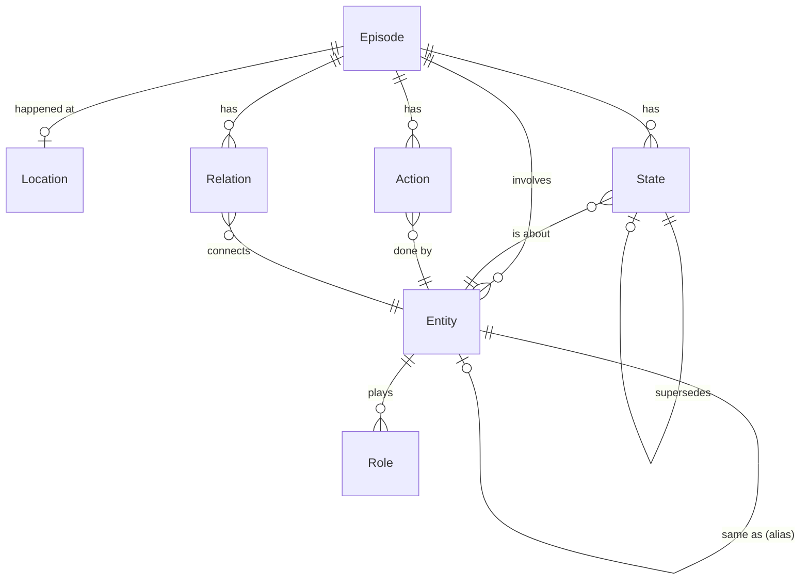

# How Reeve Works

*A guided tour of the architecture — written to be read, not just referenced.*

---

## The one-paragraph version

Reeve is long-term memory for AI. You hand it plain sentences — *"I moved to
Pune," "Alex is my co-founder," "we visited Goa in December"* — and instead of
dumping them into a pile of text and hoping a search bar finds them later, Reeve
**understands** them: it pulls out the people, the places, the facts, and how
they connect, and files them into a knowledge graph. Later, when you ask *"where
do I live now?"* or *"what did I do within 50 km of Pune?"*, it doesn't
pattern-match keywords — it reasons over that graph, knows which facts are current
and which are stale, does real distance math on real coordinates, and answers.
There's a server (the brain, `threelane_memory`) and a tiny client library (the
phone line, `reeve`).

If you read nothing else, read that. The rest of this document unpacks it.

---

## Why a graph, and not "just embeddings"

Most memory systems for AI are a vector database: chop text into chunks, turn
each into a vector, and at query time find the chunks that *feel* similar. That's
genuinely useful, and Reeve uses it too — but on its own it has three blind spots
that matter for a *memory*:

- **Similarity isn't truth.** "Pune" and "Lonavala" have similar vectors because
  they co-occur in text. But similarity can't tell you Lonavala is *54 kilometres
  away* — so a naive system will happily include it in "things within 50 km of
  Pune." Numbers aren't a vibe.
- **Facts change, and text doesn't know it.** "I live in Delhi" and "I moved to
  Pune" are both true sentences that both match a search for "where I live." A
  pile of text will hand you both and let the language model guess. It shouldn't
  have to guess.
- **A name means different things to different people.** "City Palace" is Udaipur
  for one person and Jaipur for another. "Home" is a different spot on Earth for
  every single user. Global text has one meaning per phrase; a *personal* memory
  needs one meaning per person.

So Reeve stores memories as a **graph of connected facts** — people, places,
actions, relationships, and *stateful* facts that can be replaced when life moves
on — and it grounds places in real geography. Embeddings are one of six tools it
reaches for, not the whole toolbox.

Think of it less like a search index and more like a **diligent personal
assistant** who actually remembers your life: who's who, where things are, what's
true *right now*, and — crucially — whose life is whose.

---

## Follow a memory through the system

The clearest way to understand Reeve is to watch one sentence travel through it.
Say you send:

> *"I moved to a machiya in Arashiyama, near the bamboo grove."*

### 1. It's accepted instantly, remembered slowly

Your app calls `store_memory`. Reeve writes the raw sentence into a small
**holding buffer**, hands you back a ticket (`{pending_id, persisting: true}`),
and returns *immediately* — before any of the hard work happens. This is
deliberate: extraction and graph-writing take a few seconds and several AI calls,
and you shouldn't have to wait for them.

A **background worker** picks the sentence up a moment later and does the real
work. The practical upshot, and it's worth internalizing: **a memory you just
stored becomes fully searchable ~10–60 seconds later** (longer when the system is
busy). In the meantime it's visible as "pending" short-term memory, so very recent
thoughts aren't invisible.

### 2. It gets understood, not just stored

The worker sends your sentence to the **operator** — a prompt to the chat model
whose only job is to turn prose into structure. It comes back as tidy JSON:

```jsonc
{
  "summary":   "The speaker moved to a machiya in Arashiyama, near the bamboo grove.",
  "emotion":   "neutral",
  "importance": 0.5,
  "entities":  ["speaker"],
  "actions":   [{"actor": "speaker", "verb": "moved to", "object": "machiya"}],
  "states":    [{"entity": "speaker", "attribute": "residence", "value": "Arashiyama"}],
  "location":  "Arashiyama"
}
```

If the model chokes or returns garbage, Reeve doesn't lose your memory — it falls
back to storing the plain sentence with empty structure. **A store never fails
because the AI had a bad moment.**

### 3. It's woven into the graph

The **reconciler** takes that JSON and stitches it into Neo4j, in a careful order:

- First it **enriches the place** — more on that below, but briefly: it figures
  out where Arashiyama actually is, on a map, for *you*.
- It creates the **Episode** (the memory itself).
- It resolves **"speaker"** to your canonical person-node (matching aliases so
  "Bob" and "Robert" don't become two people).
- It records the **action** ("moved to").
- And here's the good part — the **state**. "Residence = Arashiyama" is a fact
  that *replaces* an old one. So Reeve finds your previous residence fact, marks
  it **superseded**, draws a `SUPERSEDES` arrow from new to old, and flags the new
  one as active. Your old address isn't deleted — it's just no longer *current*.
  Ask "where do I live?" and you get Arashiyama. Ask "where did I used to live?"
  and the history is still there.
- Finally it attaches the memory to the **Location** node for Arashiyama.

That's the whole write path: *accepted instantly, understood by an LLM, woven into
a graph where facts have state and history.*

### 4. Asking a question runs it in reverse

Now you ask: *"Where am I staying these days?"*

Reeve fires off **seven scouts** in parallel (the "lanes" — details in their own
section), each looking for relevant memories a different way: recent ones, ones
matching a time phrase, ones matching a place, ones that are semantically similar,
ones with exact word matches, and photos that *look* like what you asked about.
It merges what they bring back into a ranked shortlist,
expands each memory into its full structured context, and hands that to the answer
model with one standing instruction: *trust this context, and when facts conflict,
prefer the most recent one.*

Out comes: *"You're staying in a machiya in Arashiyama, near the bamboo grove."*
The superseded old address never surfaces, because the graph knew it wasn't current.

---

## The cast of characters (the graph)

If the graph is a story about your life, these are the character types. Every one
of them, and how they connect, is real and queryable.

- **Episode** — a single memory. The atom of the whole system. Holds the raw text,
  a summary, an emotion, an importance score, its embeddings (text *and* image),
  a timestamp, and — for photo memories, when retention is on — a pointer to where
  the original picture is kept.
- **Entity** — a person, company, or thing ("Alex", "Lumina", "the Taj Mahal").
  Crucially, entities are **per person** — your "Alex" and someone else's "Alex"
  are different nodes entirely.
- **State** — a fact *about* an entity that can change over time ("residence =
  Arashiyama", "runway = 8 months"). States supersede each other, so the graph
  always knows the current value.
- **Action** — something that happened ("Alex mentors the interns"): a verb with
  an actor and an optional object.
- **Relation** — a link between two people or things ("Priya sits on the board").
- **Role** — a label like "co-founder" or "musician."
- **Location** — a place, also **per person**, carrying its coordinates, a written
  "vibe" description, and a vibe vector.

They connect the way you'd draw it on a whiteboard: an Episode *involves* entities,
*happened at* a location, *has* states and actions and relations; a State is *of* an
entity; an Action is *by* one entity and *on* another.



There's a small cast backstage too — **User** (your account), **MonthlyUsage**
(your meter), **SchemaMigration** (bookmarks so upgrades run once), and a few nodes
for logins and OAuth. They keep the lights on but aren't part of your memories.

> **A subtle but important detail about Roles.** Role nodes are the one type still
> shared globally by name — there's a single "musician" node everyone's musicians
> can point to. That sounds like a privacy leak, but it isn't: the *connection* is
> per-person. Your friend Alex the musician and someone's co-founder Alex are
> different Entity nodes, and Reeve only ever walks *from your entity* to its roles.
> So the shared label never leaks a relationship. (We tested this exact scenario
> adversarially — it holds.)

---

## Many people, one graph, solid walls between them

Everyone's memories live in the same Neo4j database, so the walls between them have
to be airtight. Here's how Reeve builds them.

Every memory is tagged with a **speaker key** that looks like this:

```
google-oauth2|1019…:work
└──── your account ────┘ └─┬─┘
                        namespace
```

The first half is **your account** — proven from your API key, and impossible to
fake (the server sets it, not the client). The second half is a **namespace** you
choose, and here's the model that makes Reeve tick:

> **One account → many namespaces → each namespace is one end-user.**

If you're building an app on Reeve, your API key is the account, and you give each
of *your* users their own namespace. Their memories can never reach each other, and
they can certainly never reach another company's account. Every single query and
graph walk is fenced by this key.

This is also *why* entities and locations are stored per-person rather than
globally. Two of your users can both know an "Alex" and both live near a "City
Palace" — and those genuinely mean different things. Early versions of Reeve got
this wrong (names were global, so the first person to mention "City Palace" set it
for everyone), and two careful data migrations fixed it. More on those later.

---

## The seven scouts (how retrieval works)

When you ask a question, Reeve doesn't rely on any single trick to find the right
memories — it sends out seven scouts, each with a different specialty, and combines
their findings. This is where the project's old name, *three-lane memory*, comes
from; it's grown to seven.

1. **The recent scout** grabs your last few memories no matter what. It's a safety
   net — brand-new writes might not be in the search index yet, and this ensures
   "what did I just tell you?" always works.
2. **The time scout** wakes up when your question has a time phrase ("last year,"
   "in March") and fetches memories from that window.
3. **The detail scout** catches lightweight structured filters ("age 1," "birth").
4. **The place scout** activates on spatial cues ("near Kobe," "places like Goa,"
   "within 50 km of Pune"). This one is special enough to have its own section.
5. **The meaning scout** is the classic embeddings search — it finds memories that
   *mean* something similar to your question, even in totally different words. It's
   smart about how wide to cast its net based on how much data exists.
6. **The exact-words scout** does old-fashioned full-text search, for when you need
   a specific name or object matched literally.
7. **The picture scout** searches your photos by how they *look*, using the shared
   image-and-text vector space. It's why "the red dish" can find a curry whose
   caption never said "red." It only wakes up if you actually have photos, so
   text-only users never pay for it.

The picture scout needed a different kind of gate from the others, and the reason is
instructive. There's no similarity score above which a photo is "a match" — measured
against live data, the question *"what is my startup runway?"* scored **higher**
against a random photo than *"a red curry dish"* did against an actual curry. Any
fixed threshold either lets everything in or keeps everything out. What *does*
separate them is the **shape** of the results: a real match stands clear of the
runner-up, while a question with nothing to match produces an almost flat ranking.
So the scout looks for a break in the ranking and admits the group above it.

Each scout returns a scored list. Reeve **merges** them — the score decides the
ranking, and a scout's own confidence and priority break ties. The winners get
expanded into their full context (all their entities, states, actions, and so on)
and handed to the answer model.

**One case is handled with extra care: distance questions.** When you ask "what did
I do *within 50 km of Pune*," Reeve doesn't just let the scouts vote — because the
meaning scout would happily drag in Lonavala (54 km away) on vibes alone. Instead it
takes over: it does hard geometric distance math, keeps **only** the memories
genuinely inside the radius, and then ranks *those* by the rest of your question
("which *restaurants* within 50 km"). Out-of-range places physically cannot sneak
back in. Geography wins over vibes when you asked a geography question.

---

## The map brain (geography)

This is the part of Reeve that had the most drama, so it's worth telling as a story.

The goal is simple to state: when you mention a place, Reeve should know *where it
actually is* — real coordinates — so it can do distance math and understand a
place's character. The reality is that turning a word into a point on Earth is
deceptively hard, and Reeve learned this the hard way.

**First, enrichment.** The first time you mention "Goa," Reeve looks it up on the
map (via OpenStreetMap's geocoder), stores its coordinates, asks the AI to write a
one-line "vibe card" ("Goa: beaches, Portuguese heritage, nightlife"), and turns
that card into a vector. Now "somewhere with beaches" can find your Goa trip, and
"within 50 km" can do real math.

**Then, the two traps.** The map lookup has two opposite failure modes, and Reeve
had to learn to steer between them:

- **The famous-namesake trap.** Ask a plain geocoder for "Ziro" (a small town in
  Arunachal Pradesh) and it confidently returns a *different* Ziro in Burkina Faso,
  because that one ranks higher globally. Obscure places lose to famous same-named
  ones.
- **The near-home trap.** The obvious fix — "search near where the user lives" —
  backfires spectacularly. When someone in Pune mentions their real trip to Goa
  (450 km away), searching "Goa near Pune" finds a *bus stop named Goa* three
  kilometres from their house, and cheerfully decides their beach holiday happened
  at a bus stop.

Neither "trust the map's ranking" nor "trust proximity" works alone. The insight
that fixed it: **ask what the name actually means, and let knowledge referee.**

So when a place looks suspicious, Reeve asks the chat model *"where is this,
really?"* — and uses the answer as a referee:

- If the model **agrees** with the map's first guess ("Goa → Goa, India"), it's a
  real trip. Keep it, don't second-guess.
- If the model **disagrees** ("Ziro → Arunachal Pradesh, not Burkina Faso"), Reeve
  retries the lookup steered by that knowledge — but carefully. A candidate found by
  searching near the user's *own* places must land in the right *region* (so a
  namesake café near home can't hijack the trip). A candidate found using the
  *model's* hint only needs to land in the right *country* (because map databases
  and humans name regions differently — Iceland's Vík comes back as "Southern
  Region" even though the model called it "Mýrdal").
- If the AI is **down or throttled**, Reeve does something unusual and important:
  it **gives up gracefully and tries again later**, rather than saving a guess it
  couldn't verify. A place that's temporarily unpinned is recoverable; a place
  pinned *wrong* poisons every future answer. *An error is not evidence.*

This referee logic went through six releases and a lot of live testing to get
right. Today it correctly handles Goa, Ziro, City Palace (per-person!), Nara,
Obama-the-town, and Vík — each of which broke an earlier version.

---

## Giving it eyes (photos)

Reeve can remember photos three ways, and the third one is why it keeps the
original.

- **It can describe them.** Send an image (as a URL, or bytes from the SDK) and a
  vision model looks at it and writes a caption — *"a sunset over a calm ocean with
  a small island in the distance."* That caption flows through the normal pipeline,
  so your photo becomes a fully structured, searchable memory like any sentence. If
  the photo has GPS data baked in, Reeve reads it and figures out where it was taken.
  The caption is explicitly asked for **dominant colours**, which sounds fussy until
  you try asking about "the red dish" and discover the model wrote "creamy, with
  coconut flakes" and never mentioned red at all.
- **It can recognize them by feel.** It also turns the image into a vector in a
  shared image-and-text space, so you can search "beach photos" in words *or* hand
  it a different beach photo and say "find ones like this." Since 0.1.41 that vector
  is a full retrieval lane, so ordinary questions reach photos by how they *look*,
  not only by what the caption happened to say.
- **It can go back and look again.** This is the one that needs the original. An
  embedding is a fingerprint: perfect for *"find the photo like this one,"*
  incapable of *"how many people were in it?"* Those questions get asked months
  later, long after the caption was written, so answering them means keeping the
  picture and showing it to the vision model at question time.

**Your text and the photo become one memory, not two.** Your caption is glued to
the generated description and the pair goes through extraction together, which is
what makes *"where did I eat the red dish?"* work: "red" comes from the picture,
the restaurant's name comes from your sentence, and they're in the same episode.

**What Reeve keeps.** Photo retention is **opt-in and off by default**; production
runs it on. When it's on, the original goes to an encrypted S3 bucket in Mumbai and
is kept **until you delete the memory** — no expiry clock, because a finite window
fails silently: on day 31 you ask what a sign said and get a vague answer with no
explanation, which just reads as the product forgetting.

That makes deletion load-bearing, so it's built accordingly. Object keys are
prefixed with a *hash* of the tenant, so a bucket listing reveals no account IDs or
namespace names. A read re-derives the key from the requester, so a stale or crafted
key can't reach another tenant's photo. Erasure sweeps by prefix rather than by the
keys stored on episodes — deliberately, because that also reclaims photos whose
write was cancelled before an episode ever existed, which nothing else would find.
And a write that exhausts its retries deletes the photo it already uploaded.

Even so, the picture is the *least* durable part of a photo memory. The description,
the image vector and the whole graph live in the database and outlive it. If a
photo ever does go, text search, colour questions and image-to-image search all keep
working; only asking something new about the pixels stops.

One honest wrinkle worth knowing: attaching a file in Claude Desktop doesn't
actually pass the image bytes to the tool, so that path can't do true image search.
Use an image URL instead, and it works beautifully.

---

## The three specialists (the AI models)

Reeve doesn't use one AI for everything — it hires three specialists, each in its
own slot, swappable independently:

| The job | The specialist | Why |
|---|---|---|
| Thinking, extracting, answering | **Mistral Large** | A strong reader/writer for the language-heavy work. |
| Looking at photos | **Amazon Nova Lite** | Genuinely multimodal — it can see. |
| Turning things into vectors | **Amazon Titan** (text + image) | Purpose-built embedding models. |

The split matters more than it looks. Mistral is text-only — it *cannot* see an
image — so when a question turns out to be about a photo, the answer is routed to
Nova with the picture attached instead. Ordinary text questions never pay for that
detour.

They're wired to separate settings, so swapping the "thinking" model never touches
"seeing" or "vectorizing." (This split matters: an earlier config had Nova doing the
thinking too, and it fumbled a "did I move house?" question that Mistral gets right
every time. Switching only the thinking slot fixed it, with zero risk to photos.)

Under the hood, every AI call goes through a resilient client that **automatically
retries** when the provider is overloaded, with polite exponential backoff. It's
robust — but not infinite. Hammer it hard enough (or hit a tight account rate limit)
and even good retries run out, which is a *capacity* thing to plan for, not a bug to
fix.

---

## How you actually plug it in

Everything above describes the brain. This is the part developers touch, and it
comes in three sizes depending on how much control you want.

**The whole thing, one line.** `ReeveAgent` wraps whatever chat model you already
use and quietly handles memory on both sides of every turn — it retrieves what's
relevant before your model sees the message, and files away anything worth keeping
afterwards. You call `.chat()` and never think about storage or retrieval. It's
framework-agnostic: it wraps a callable, not a specific library.

**The memory layer, your loop.** `ReeveMemory` (also exported as `ReeveMiddleware`
and `AgentMemory` — same class, three names, because people look for it under
different words) splits that into two explicit calls you place yourself: one before
the model call to inject context, one after to extract and store. Use this when you
have your own agent loop, your own prompt assembly, or your own idea of when memory
should be consulted.

**Just the pieces.** The plain functions — `store`, `query`, `retrieve_memory_context`,
`search_image_memories` — are always there if you want to do everything by hand. The
distinction worth knowing: `query` returns a *sentence written by Reeve's model*,
while `retrieve_memory_context` returns the raw facts for you to feed to your own
model with your own persona. Products with a voice of their own want the second.

Two pieces of judgment are built into the middle layer, and both exist to stop
memory becoming expensive noise:

- **A relevance policy** decides whether a message is even worth a memory lookup.
  "thanks!" and "ok sounds good" don't need a database round-trip, and skipping them
  is the difference between memory being cheap and memory being a tax on every turn.
- **A durable-memory extractor** decides what's worth *keeping* from a conversation.
  Chat is mostly filler; the goal is to store "Alex is my co-founder," not "sure,
  let me check." It pulls out durable facts and relationships and drops the rest.

The backend behind all of this is an interface, not a hard-wired call — the default
talks to the hosted Reeve service, but anything satisfying `MemoryBackend` can be
dropped in, which is what makes the middleware testable without a network.

**Framework adapters** ship for LangChain, LangGraph, CrewAI, Agno, and the OpenAI
Agents SDK, so if you're already in one of those, the integration is an import rather
than a rewrite. And because the transport is MCP, any MCP-speaking client — Claude
Desktop among them — can use Reeve as a tool with no SDK at all.

**A note on long-lived apps.** The connection to the hosted service is a session that
expires when idle and dies on every deploy. An agent loop or web backend sitting quiet
for a few minutes used to wake up to a dead connection; the client now reconnects and
retries once, transparently. Deliberately *only* on a dead session — a failed write is
never blindly retried, because that could apply it twice.

---

## The machinery that keeps it honest

A few systems work quietly in the background to keep everything trustworthy.

**Async writes.** As mentioned, stores are acknowledged instantly and persisted by a
background worker. The tradeoff is that ~30 seconds after a burst of writes, some may
still be settling — which is why anything that checks "is my memory there yet?" should
give it a moment.

**Migrations.** When the data model needs to change — like the two upgrades that made
entities and locations per-person — Reeve runs a **migration**: a careful, one-time,
resumable transformation of the existing graph. Each one leaves a bookmark so it never
runs twice, and they apply automatically on server startup (or can be previewed with
`reeve migrate --dry-run` first). The big ones split the old shared-by-name nodes into
per-person copies without losing a single memory or edge.

**Cleanup tools.** A set of maintenance commands, available from the CLI and (mostly)
as tools:

| Command | What it's for |
|---|---|
| `dedup` | Merge duplicate entities — the same person written two ways |
| `consolidate` | Compact old low-importance memories into summaries |
| `backup` | Export the whole graph (or one namespace) to JSON |
| `geo-backfill` | Resolve places that were never geocoded, or re-resolve ones pinned wrong |
| `reindex` | Re-embed every memory after an embedding-model change — the escape hatch that keeps a 70-year memory from being trapped on one vendor's model |
| `migrate` | Apply pending schema migrations, `--dry-run` to preview |
| `clear` | Hard-delete everything for one namespace, including retained photos |
| `eval` | Run the ground-truth evaluation set |

`clear` is the one users can reach directly, because "delete my data" has to be a
button they can press, not a support ticket.

---

## The business layer

**Logging in.** Users authenticate either with an **API key** (stored only as a hash —
Reeve never keeps the raw key) or a **Google login / web session**. Both resolve to a
stable account identity that scopes all their data.

**Plans and limits.** Accounts sit on a plan — free, pro, or enterprise — that sets
how many requests per minute, queries per month, and tokens per month they get:

| | Free | Pro | Enterprise |
|---|---|---|---|
| Requests / window | 220 | 1,000 | 5,000 |
| Queries / month | 20,000 | 100,000 | 1,000,000 |
| Tokens / month | 1 million | 4 million | 100 million |

Free users are hard-stopped at their token limit; paid plans can spill over into
metered billing. Every token in and out is metered per account per month. (Fun fact
from testing: this system works so well it once blocked the founder's own account
mid-testing.)

---

## Where the bodies are buried (honest limitations)

Good docs tell you what *doesn't* work yet. Here's the current list:

- **AI throttling under heavy load** — the retry logic is solid, but a tight cloud
  rate limit plus a burst of traffic can still surface errors. This is a "request a
  quota increase before you scale" item, not a code fix.
- **Long documents dilute** — paste a 4,000-word brain-dump with one key decision
  buried inside, and that decision's vector gets watered down; a busy namespace can
  miss it on a targeted search. The fix is to chunk long inputs, which isn't built yet.
- **Twin-famous names** — a place like "Cambridge," famous in *two* countries, can
  pin to the wrong one for a user near the less-famous Cambridge. A rare edge with a
  known-but-not-yet-built fix.
- **The picture scout misses about 1 in 5 real matches** — specifically when you own
  several similar photos and ask a long, wordy question, so nothing breaks away from
  the pack. This is a deliberate trade, not an oversight: a hit both joins retrieval
  *and* triggers a vision call that could answer from the wrong photo, while a miss
  costs nothing, because the text scouts still reach that memory through its
  description. Explicit photo search skips the gate entirely and always returns its
  best match.
- **Photos are processed outside India** — the bucket is in Mumbai, but the AI models
  run in Oregon, so every image travels there to be described and embedded. Storing
  in India isn't the same as processing in India, and that distinction belongs in
  your privacy notice.
- **The MCP library is pinned below 2.0** — its 2.x release removed the server
  component Reeve is built on. The pin keeps builds reproducible; the migration is
  real work that hasn't been done.
- **The settling delay** — the async lag, by design.
- **Desktop photo attach** — the Claude Desktop wrinkle mentioned earlier.

None of these are open wounds. Most are edges and operational planning; the two worth
tracking are the region split, because it's a disclosure question rather than a
technical one, and the MCP pin, because it will age.

---

## How we know it works

Reeve is backed by two kinds of tests, and the philosophy behind them is worth
stating because it shaped the product.

**Unit tests** (~400 of them, run on every push) lock down the logic — including a
suite of *robustness contracts* that guarantee the unglamorous but critical promises:
a store never crashes because the geocoder or AI is down; a query never breaks because
a lane failed; the system never makes an unbounded number of expensive API calls; and
the AI-reply parser survives literally any garbage a model might return. Some of them
pin *measurements* rather than logic — the picture scout's tests carry 22 complete
score distributions captured from the live system, so anyone retuning that gate has to
re-score it against real data instead of intuition.

**Live feature suites** run against the real deployed service with throwaway test users,
probing the whole thing end-to-end — geography, photos, multi-tenant isolation, and a
deliberately hostile suite that tries prompt injection, cross-user leakage, negation
("we did *not* raise a round"), unicode, and buried facts. The newest one is Icelandic
fieldwork, built to attack the photo features specifically: near-duplicate pairs (two
puffins, two waterfalls) to stress the picture scout, diacritics through the whole
pipeline, and one photo of a Las Vegas sign stored under the caption *"a souvenir
someone brought back."* Asked what the sign said, Reeve answered *"Welcome to Fabulous
Las Vegas"* — a fact no caption contained and no text lane could have produced. It
passes 20 of 20.

Two hard-won lessons are threaded through all of it. **Test each thing at the layer
that owns it** — whether a memory was *retrieved* is a question for the engine, not for
the chatbot's phrasing, and confusing the two led us to chase several "failures" that
were really the AI wording things differently. And **calibrate on the input the system
actually receives**: the picture scout's gate was tuned twice on tidy phrases before
anyone noticed real questions arrive as whole sentences, which changes the numbers
enough to break it.

---

*This document describes Reeve at version 0.1.41. For the blow-by-blow of how the map
brain and the migrations evolved, the team's project notes have the full history — and
the code, of course, is the final word. Operators turning photo retention on should
read `IMAGE_RETENTION.md`, which covers the setup and, more importantly, the line
between what the code guarantees and what remains a policy obligation.*
